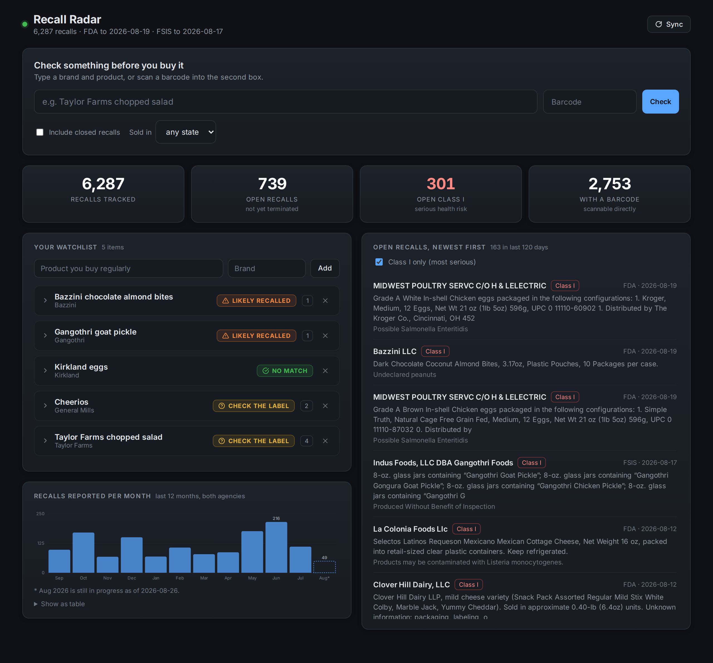
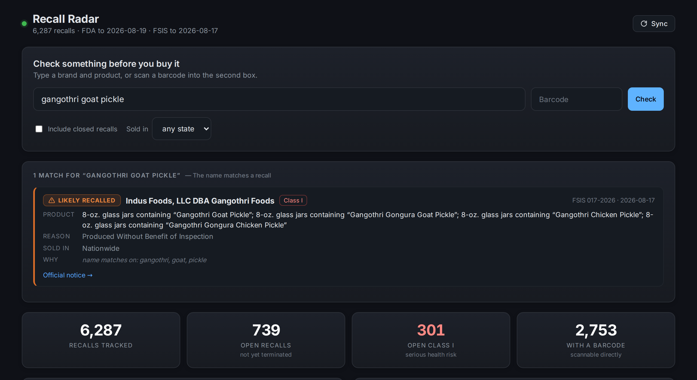
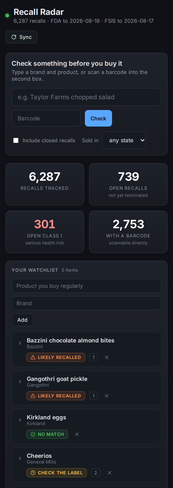

# recall-radar

Check the food your family buys against live U.S. food recall data — ideally
*before* it goes in the cart.

Recall news reaches people through headlines, and headlines cover maybe the
biggest recall each month. There are roughly **1,600 FDA food recalls a year**,
plus several hundred from USDA, and most of them are never reported anywhere a
parent would see. This pulls all of them into a local database and tells you
whether a specific thing you are about to buy is on the list.

## The dashboard

`./start.sh` syncs the latest recalls and opens a local dashboard at
<http://localhost:5055>.



The search box at the top is the point of the whole thing: type what you are
about to buy, get an answer before it goes in the cart. Below it, your
watchlist shows the current state of everything you buy regularly, and the
feed shows every open recall from both agencies, newest first.

| Checking one item | On a phone, in the aisle |
| --- | --- |
|  |  |

The browser layer is a thin shell over the same `matcher.check` the CLI calls,
so the two front-ends cannot drift into disagreeing about whether something is
recalled. Flask is the only third-party package in the project, and only the
dashboard needs it (`pip install -e ".[web]"`).

## The command line

```console
$ recall-radar check "Bazzini chocolate almond bites"

1 match for Bazzini chocolate almond bites - the name matches a recall:

 LIKELY RECALLED  Bazzini LLC  (Class I, FDA H-1228-2026, 2026-08-19)
    product : Dark Chocolate Coconut Almond Bites, 3.17oz, Plastic Pouches
    reason  : Undeclared peanuts
    sold in : The product was distributed to WA.
    why     : name matches on: bazzini, bites, almond, chocolate (score 1.0)
    codes   : B15354, B15356, B15357, B15360, B15361, B15363

$ recall-radar check "Ben and Jerry ice cream"
No match - 'Ben and Jerry ice cream' does not appear in any open recall on file.
```

## Data sources

| Source | Covers | Notes |
| --- | --- | --- |
| [openFDA food enforcement](https://open.fda.gov/apis/food/enforcement/) | Produce, packaged food, dairy, seafood, supplements | No API key needed. Roughly a one-week lag from publication. |
| [USDA FSIS recalls](https://www.fsis.usda.gov/) | Meat, poultry, processed egg products | Same-day. Sits behind bot protection — see *Known fragility*. |

The two agencies split the food supply between them, so both are needed: FDA
does not cover the chicken, and USDA does not cover the spinach.

## Install

No dependencies beyond Python 3.9+.

```console
git clone <this repo> && cd recall-radar

./start.sh                # dashboard: makes a venv, syncs, opens the browser

# or command line only - no dependencies at all:
python3 -m recall_radar sync    # first sync pulls ~6,000 recalls in ~10 seconds
python3 -m recall_radar check "taylor farms chopped salad"
```

`./start.sh --fast` skips the sync and opens cached data immediately.

## Use

```console
# In the store, deciding whether to buy something
recall-radar check "taylor farms chopped salad"
recall-radar check --upc 740235500110          # scanned barcode
recall-radar check "ground beef" --state IL    # only recalls distributed to Illinois

# The household list: the things you buy regularly
recall-radar watch add "Bazzini chocolate almond bites" --brand Bazzini
recall-radar watch add "Carley's lemon cookies" --upc 740235500110
recall-radar watch list

# Sweep the whole list. --new only reports what you have not been told before,
# which makes this safe to run from cron.
recall-radar scan
recall-radar scan --new
```

`check` and `scan` exit `1` when they find something and `0` when they do not,
so they compose with shell scripts and cron.

## How matching works

Everything the tool can be pointed at — a typed name, a scanned barcode, text
read off a package photo — collapses into a single `Query`, and `matcher.check`
is the whole decision. Front-ends are thin adapters over it.

**A barcode is proof; a name is a guess**, and the two are never reported the
same way:

| Verdict | Means | Triggered by |
| --- | --- | --- |
| `RECALLED` | This exact item is on a recall | Barcode found in the recall's code information, check digit valid |
| `LIKELY RECALLED` | The name matches a recall | ≥85% of the query's weighted terms matched, including a distinctive one |
| `POSSIBLE MATCH` | Worth reading the label | Partial or generic overlap only |

Name matching weights terms by how rare they are across the whole corpus, so
`bazzini` carries a match and `farms`, `organic` or `chocolate` barely move it.
Three rules keep it honest, each of which exists because it caught a real false
positive during development:

- **A generic word can never produce a confident match.** A one-word query like
  `chicken` covers itself perfectly and so scores 1.0; without a distinctiveness
  gate that reads as "LIKELY RECALLED" against *Chicken of the Sea* tuna.
- **Confidence is capped when the query's most distinctive term misses.**
  `organic baby spinach` overlaps *Organic BABY bedtime drops* on two common
  words. It still surfaces, marked `but not 'spinach'` — it is never announced
  as a recall.
- **Rarity is measured against corpus size, not a fixed threshold**, so a
  database that has only synced one month behaves like a full one instead of
  quietly downgrading every result.

The honest limitation: term rarity is not the same as knowing which word names
the food. In the current corpus `baby` appears in fewer recalls than `spinach`,
so the tool cannot tell which one you meant. That is exactly why partial matches
say *check the label* instead of *this is recalled*.

## Scope and safety

- **Open recalls only, by default.** A terminated recall means the product was
  pulled; pass `--all` to search closed ones too, which is what you want when
  auditing food already in the house rather than food on a shelf.
- **A missing distribution list never hides a recall.** `--state` filters out
  recalls known to have gone elsewhere; recalls that are nationwide, or whose
  distribution could not be parsed, always pass through.
- **This is a search tool, not an authority.** It reports what the agencies
  published. Always confirm against the linked official notice before acting,
  and if a product in your kitchen is recalled, follow the agency's instructions
  rather than your own judgment about whether it looks fine.

## Known fragility

The USDA FSIS endpoint rejects a plain HTTP client with `403` and only responds
to a complete, browser-shaped set of request headers (`recall_radar/sources/fsis.py`).
This is documented rather than hidden: if USDA tightens those rules the adapter
raises `SourceError`, `sync` reports the failure, and FDA data still updates.
FSIS also serves the entire recall history in one ~13 MB response with no date
filter, so its sync always fetches everything and filters locally.

## Adding a source

Write one `fetch()` that yields the record shape in `recall_radar/sources/base.py`
and register it in `sync.SOURCES`. Nothing downstream knows which agency a
recall came from — states, barcodes, lot codes and the search index are all
derived from the shared fields.

## Design notes on the dashboard

- **Severity is never carried by colour alone.** Every verdict badge pairs its
  hue with an icon and a word, so it still reads in greyscale, under
  colourblindness, or in a screenshot pasted into a message.
- **The in-progress month is drawn as a dashed outline, not a short bar.**
  August is always low on the 26th; a solid bar there reads as a real drop in
  recalls. It is excluded from the peak label and footnoted with the as-of date.
- **Every charted value is also reachable without hovering** - the peak is
  directly labelled and a *Show as table* view sits under the chart.
- The palette is deliberately the same one `finance-viz` uses, so the two local
  dashboards read as siblings.

## Development

```console
python3 -m unittest discover -s tests -t .
```

36 tests, no network access required — the source adapters are tested against
captured payload shapes, including the malformed and edge-case records that
broke earlier versions.

## Roadmap

The matching core is deliberately front-end agnostic. The obvious next layers:

- **Barcode scanning** — a phone camera feeding `Query.from_barcode`. About 68%
  of FDA recalls carry a parseable UPC, so this is the highest-precision input
  available.
- **Package photos** — OCR into `Query.from_text`, for the ~32% without one.
- **Alerting** — `scan --new` already keeps a dedupe ledger in the `alerts`
  table, so a cron job plus an email or push sender is a small addition.

The dashboard's `/api/check` already accepts a `upc` parameter, so a phone
camera feeding barcodes into it needs no backend work.
