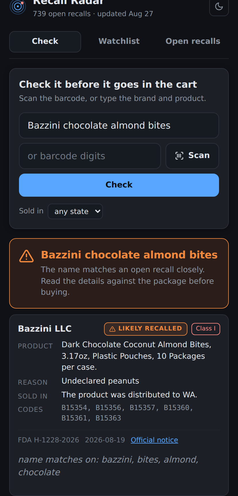
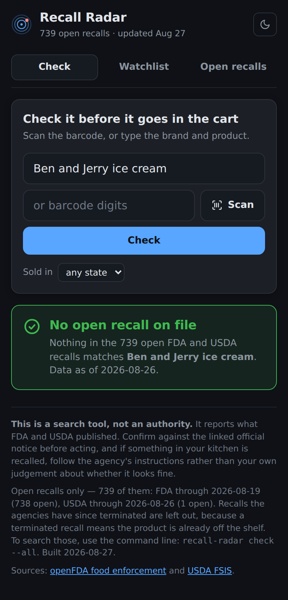
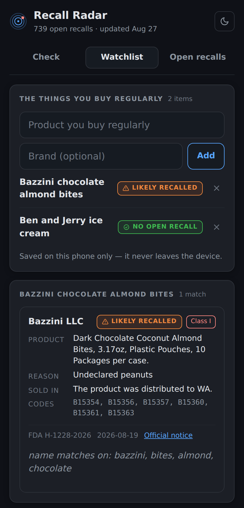
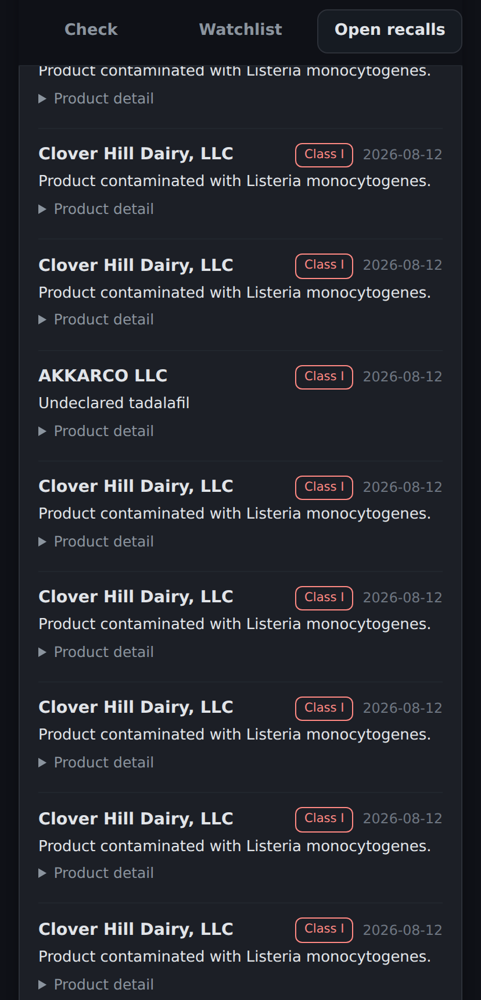

# recall-radar

Check the food your family buys against live U.S. food recall data — ideally
*before* it goes in the cart.

Recall news reaches people through headlines, and headlines cover maybe the
biggest recall each month. There are roughly **1,600 FDA food recalls a year**,
plus several hundred from USDA, and most of them are never reported anywhere a
parent would see. This pulls all of them into a local database and tells you
whether a specific thing you are about to buy is on the list.

## The phone app

**Live: https://barnabys-drew.github.io/recall-radar/**

The dashboard below needs a laptop, a Python process and a 30 MB database. The
place you actually need this is a grocery aisle, holding a jar, on a phone with
one bar of signal. So the same matcher is baked into a single page that carries
its own copy of the corpus and answers with no network at all.

Open the link on a phone and install it to your home screen — it runs like an
app and works with no signal.

- **iPhone (Safari):** Share button → **Add to Home Screen**
- **Android (Chrome):** ⋮ menu → **Install app** / **Add to Home screen**

To run it locally instead:

```console
python3 build.py                       # bake the page
python3 -m http.server -d docs 8000    # then open http://localhost:8000
```

`localhost` counts as a secure context, so the service worker and offline mode
work there too.

| Something on the list | Something that is fine |
| --- | --- |
|  |  |

Three tabs:

- **Check** — the whole point. Scan the barcode with the camera, or type the
  brand and product. On Android the camera reads UPC and EAN codes directly; iOS
  Safari has no barcode API, so there it falls back to typing the digits printed
  under the bars. A state filter narrows results to recalls actually distributed
  where you live.
- **Watchlist** — the things you buy every week, re-scored against the current
  data every time you open it. Stored in the browser on that one phone; it is
  never uploaded anywhere, because there is nowhere to upload it to.
- **Open recalls** — everything currently open from both agencies, newest first,
  filterable to Class I and to your state.

| Watchlist | Open recalls |
| --- | --- |
|  |  |

### What is baked in, and what that costs

The page ships about 790 KB: every **open** recall from both agencies, the
inverted index, the barcode index, and document frequencies measured over the
whole corpus *including* terminated recalls — so a token carries the same rarity
weight it would on the command line.

Terminated recalls themselves are left out. They are five sevenths of the corpus
and would add roughly 5 MB to a page meant to load on a phone, and they answer a
different question — what is already in the pantry — than the one this page
exists for. Use `recall-radar check --all` for those.

The data is exactly as old as the last build, so the page says so: the header
carries the build date, and past seven days a banner tells whoever is holding
the phone that the data is stale and to check the agencies directly. A daily
GitHub Action re-bakes it, described under [Building the app](#building-the-app).

## The dashboard

`./start.sh` syncs the latest recalls and opens a local dashboard at
<http://localhost:5055>.


The search box at the top is the point of the whole thing: type what you are
about to buy, get an answer before it goes in the cart. Below it, your
watchlist shows the current state of everything you buy regularly, and the
feed shows every open recall from both agencies, newest first.

| Checking one item | On a phone, in the aisle |
| --- | --- |
|  |  |

The browser layer is a thin shell over the same `matcher.check` the CLI calls,
so the two front-ends cannot drift into disagreeing about whether something is
recalled. Flask is the only third-party package in the project, and only the
dashboard needs it (`pip install -e ".[web]"`).

## The command line

```console
$ recall-radar check "Bazzini chocolate almond bites"

1 match for Bazzini chocolate almond bites - the name matches a recall:

 LIKELY RECALLED  Bazzini LLC  (Class I, FDA H-1228-2026, 2026-08-19)
    product : Dark Chocolate Coconut Almond Bites, 3.17oz, Plastic Pouches
    reason  : Undeclared peanuts
    sold in : The product was distributed to WA.
    why     : name matches on: bazzini, bites, almond, chocolate (score 1.0)
    codes   : B15354, B15356, B15357, B15360, B15361, B15363

$ recall-radar check "Ben and Jerry ice cream"
No match - 'Ben and Jerry ice cream' does not appear in any open recall on file.
```

## Data sources

| Source | Covers | Notes |
| --- | --- | --- |
| [openFDA food enforcement](https://open.fda.gov/apis/food/enforcement/) | Produce, packaged food, dairy, seafood, supplements | No API key needed. Roughly a one-week lag from publication. |
| [USDA FSIS recalls](https://www.fsis.usda.gov/) | Meat, poultry, processed egg products | Same-day. Sits behind bot protection — see *Known fragility*. |

The two agencies split the food supply between them, so both are needed: FDA
does not cover the chicken, and USDA does not cover the spinach.

## Install

No dependencies beyond Python 3.9+.

```console
git clone <this repo> && cd recall-radar

./start.sh                # dashboard: makes a venv, syncs, opens the browser

# or command line only - no dependencies at all:
python3 -m recall_radar sync    # first sync pulls ~6,000 recalls in ~10 seconds
python3 -m recall_radar check "taylor farms chopped salad"
```

`./start.sh --fast` skips the sync and opens cached data immediately.

## Use

```console
# In the store, deciding whether to buy something
recall-radar check "taylor farms chopped salad"
recall-radar check --upc 740235500110          # scanned barcode
recall-radar check "ground beef" --state IL    # only recalls distributed to Illinois

# The household list: the things you buy regularly
recall-radar watch add "Bazzini chocolate almond bites" --brand Bazzini
recall-radar watch add "Carley's lemon cookies" --upc 740235500110
recall-radar watch list

# Sweep the whole list. --new only reports what you have not been told before,
# which makes this safe to run from cron.
recall-radar scan
recall-radar scan --new
```

`check` and `scan` exit `1` when they find something and `0` when they do not,
so they compose with shell scripts and cron.

## How matching works

Everything the tool can be pointed at — a typed name, a scanned barcode, text
read off a package photo — collapses into a single `Query`, and `matcher.check`
is the whole decision. Front-ends are thin adapters over it.

The phone app cannot call that function, so `web/matcher.js` is a hand port of
it. A port that drifts is worse than no port at all: the phone would say *no
open recall* about food the command line knows is recalled, and nobody would
find out until it mattered. So `tests/test_web_parity.py` runs both
implementations over one corpus and fails if they disagree on any verdict,
score, or explanation string. Making that guarantee total is also why ties are
broken by recall id rather than left to whatever order SQLite returned.

**A barcode is proof; a name is a guess**, and the two are never reported the
same way:

| Verdict | Means | Triggered by |
| --- | --- | --- |
| `RECALLED` | This exact item is on a recall | Barcode found in the recall's code information, check digit valid |
| `LIKELY RECALLED` | The name matches a recall | ≥85% of the query's weighted terms matched, including a distinctive one |
| `POSSIBLE MATCH` | Worth reading the label | Partial or generic overlap only |

Name matching weights terms by how rare they are across the whole corpus, so
`bazzini` carries a match and `farms`, `organic` or `chocolate` barely move it.
Three rules keep it honest, each of which exists because it caught a real false
positive during development:

- **A generic word can never produce a confident match.** A one-word query like
  `chicken` covers itself perfectly and so scores 1.0; without a distinctiveness
  gate that reads as "LIKELY RECALLED" against *Chicken of the Sea* tuna.
- **Confidence is capped when the query's most distinctive term misses.**
  `organic baby spinach` overlaps *Organic BABY bedtime drops* on two common
  words. It still surfaces, marked `but not 'spinach'` — it is never announced
  as a recall.
- **Rarity is measured against corpus size, not a fixed threshold**, so a
  database that has only synced one month behaves like a full one instead of
  quietly downgrading every result.

The honest limitation: term rarity is not the same as knowing which word names
the food. In the current corpus `baby` appears in fewer recalls than `spinach`,
so the tool cannot tell which one you meant. That is exactly why partial matches
say *check the label* instead of *this is recalled*.

## Scope and safety

- **Open recalls only, by default.** A terminated recall means the product was
  pulled; pass `--all` to search closed ones too, which is what you want when
  auditing food already in the house rather than food on a shelf. The phone app
  has no `--all`: only open recalls are baked into it.
- **A missing distribution list never hides a recall.** `--state` filters out
  recalls known to have gone elsewhere; recalls that are nationwide, or whose
  distribution could not be parsed, always pass through.
- **This is a search tool, not an authority.** It reports what the agencies
  published. Always confirm against the linked official notice before acting,
  and if a product in your kitchen is recalled, follow the agency's instructions
  rather than your own judgment about whether it looks fine.

## Known fragility

The USDA FSIS endpoint rejects a plain HTTP client with `403` and only responds
to a complete, browser-shaped set of request headers (`recall_radar/sources/fsis.py`).
This is documented rather than hidden: if USDA tightens those rules the adapter
raises `SourceError`, `sync` reports the failure, and FDA data still updates.
FSIS also serves the entire recall history in one ~13 MB response with no date
filter, so its sync always fetches everything and filters locally.

## Adding a source

Write one `fetch()` that yields the record shape in `recall_radar/sources/base.py`
and register it in `sync.SOURCES`. Nothing downstream knows which agency a
recall came from — states, barcodes, lot codes and the search index are all
derived from the shared fields.

## Design notes on the dashboard

- **Severity is never carried by colour alone.** Every verdict badge pairs its
  hue with an icon and a word, so it still reads in greyscale, under
  colourblindness, or in a screenshot pasted into a message.
- **The in-progress month is drawn as a dashed outline, not a short bar.**
  August is always low on the 26th; a solid bar there reads as a real drop in
  recalls. It is excluded from the peak label and footnoted with the as-of date.
- **Every charted value is also reachable without hovering** - the peak is
  directly labelled and a *Show as table* view sits under the chart.
- The palette is deliberately the same one `finance-viz` uses, so the two local
  dashboards read as siblings.

## Building the app

```console
python3 build.py                  # sync both agencies, then bake the page
python3 build.py --no-sync        # bake from whatever is already in the database
```

One source, two outputs:

| Output | What it is for |
| --- | --- |
| `docs/index.html` | The installable site served by GitHub Pages (`main` → `/docs`), plus `sw.js`, a manifest and generated icons. Committed. |
| `recall-radar.html` | A body fragment for a Claude Artifact, which supplies its own `<html>`/`<head>`. Git-ignored — rebuild it when you want to publish one, so it cannot go stale against the data. |

Edit **`template.html`** (markup, styling, UI) and **`web/matcher.js`** (the
scoring port), then rebuild. Do not edit `docs/index.html` or
`recall-radar.html` directly; both are generated and will be overwritten.
`build.py` also stamps `docs/sw.js` with a hash of the page, so a rebuild
invalidates yesterday's recalls sitting in someone's phone cache.

**`build.py` refuses to write a page that lost an agency.** If a fetch returns
too few records, or a source's newest recall is implausibly old, it exits
non-zero rather than shipping. This matters more than it looks: FDA does not
cover the chicken and USDA does not cover the spinach, so a page missing one of
them would answer *no open recall* to questions it never looked at. Pass
`--allow-partial` only if you have decided that is what you want.

The check is on total records and recency, not on how many recalls are open.
USDA closes recalls quickly and normally has one or two open at any moment, so
an open-count floor would fail every build.

`.github/workflows/rebuild.yml` runs the same command every morning and commits
the result, so the hosted page is never more than a day behind. A failed fetch
fails the job and leaves the last good build serving — stale-but-complete beats
fresh-but-missing-the-meat. GitHub Pages serves `main → /docs`, so the commit
the job makes is the deploy.

Note that `docs/index.html` is ~790 KB and is rewritten every day, so the daily
job adds that much churn to the history. Git deltas most of it away — the recall
text barely changes between builds — but it is the price of a page that carries
its own data.

## Development

```console
python3 -m unittest discover -s tests -t .
```

42 tests, no network access required — the source adapters are tested against
captured payload shapes, including the malformed and edge-case records that
broke earlier versions.

Six of those are the browser parity suite. They shell out to `node`, and skip
themselves if it is not installed, so `web/matcher.js` is only ever verified
where it can be: `tests/parity_driver.js` loads that exact file and runs it
against the Python matcher over a corpus built in the test.

## Roadmap

The matching core is deliberately front-end agnostic. Barcode scanning is now
built — the phone app's camera feeds `Query.from_barcode`, which is the
highest-precision input available, and about 68% of FDA recalls carry a
parseable UPC. What is left:

- **Package photos** — OCR into `Query.from_text`, for the ~32% of recalls with
  no barcode, and for the times the barcode will not read.
- **Barcode scanning on iPhone** — Safari has no `BarcodeDetector`, so iOS falls
  back to typed digits today. Fixing it means vendoring a JavaScript UPC/EAN
  decoder into the page.
- **UPC-E in the core** — the phone app expands zero-suppressed UPC-E codes to
  UPC-A in its input adapter, because that is the form a camera reports.
  `normalize.to_gtin14` still rejects an 8-digit code, so the CLI cannot be
  handed one directly.
- **Alerting** — `scan --new` already keeps a dedupe ledger in the `alerts`
  table, so a cron job plus an email or push sender is a small addition.
